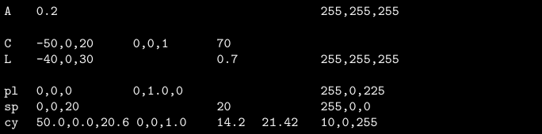

*This project has been created as part of the 42 curriculum by mitsato, keitotak.*

# miniRT

## Description

This project renders three-dimensional (3D) computer-generated (CG) images using the C programming language and the **ray tracing** technique. The program reads a scene description file in the .rt format, which contains the data needed to build a 3D scene, including object positions, direction vectors, and color values for primitives such as spheres, planes, and cylinders. Based on this input, it generates the corresponding image.

The goal of this project is to implement a simple but functional ray tracing renderer while deepening the understanding of fundamental graphics concepts and translating mathematical formulas into practical program logic.

### Project Overview

miniRT is a small ray tracing project focused on parsing scene files and rendering basic geometric objects. It provides an opportunity to explore core concepts such as ray-object intersection, vector operations, camera setup, and basic lighting.

### RT File

The RT file is a scene description file in the .rt format that the program reads to render a 3D image. Each line represents one piece of information about the scene, and each element is described by a specific identifier at the beginning of the line.

The first field of each line is always an identifier that indicates the type of information:

- A: Ambient lighting
- C: Camera
- L: Light
- sp: Sphere
- pl: Plane
- cy: Cylinder

Each element must follow a fixed structure and order of parameters. For example, ambient lighting is written as:

```text
A 0.2 255,255,255
```

where the values represent the ambient lighting ratio and the RGB color.

The program reads the file by parsing these elements line by line. Parameters such as coordinates, vectors, colors, and other numeric values are provided according to the required format for each object type. The file may contain multiple elements, and the order of the elements is not restricted, although some elements such as ambient lighting, camera, and light can only be declared once.

Below is an example of an RT file:



---

## Instructions

### Compilation

To build the program, run:

```bash
make
```

### Execution

To run the program, use:

```bash
./miniRT PATH/TO/RT_FILE
```

Example:

```bash
./miniRT scene_rt/sample.rt
```

### Cleanup

To remove object files:

```bash
make clean
```

To remove object files and the compiled binary:

```bash
make fclean
```

To recompile from scratch:

```bash
make re
```

---

## Resources

The following references were helpful for understanding ray tracing and related mathematical concepts:

### Website

- [Ray Tracing in One Weekend](https://inzkyk.xyz/ray_tracing_in_one_weekend/) — A beginner-friendly introduction to the basics of ray tracing.
- [Ray to Cylinder](http://marupeke296.com/COL_3D_No25_RayToSilinder.html) — A useful reference for implementing ray-cylinder intersection.
- [Rodrigues' Rotation Formula](https://w3e.kanazawa-it.ac.jp/math/physics/category/physical_math/linear_algebra/henkan-tex.cgi?target=/math/physics/category/physical_math/linear_algebra/rodrigues_rotation_formula.html) — A reference for understanding vector-based rotation.

### Articles & Documentation

- [MSS Report](https://www.mesw.co.jp/business/report/pdf/mss_18_07.pdf) — A document providing background on mathematical and geometric concepts relevant to the project.

### Video

- [Ray Tracing Basics](https://youtu.be/UTz7ytMJ2yk?si=pZ1TBdvrACGgFxAc) — A visual overview of the core ideas behind ray tracing.

---

## How AI Was Used

- Used AI for frequent code review and feedback to improve clarity, structure, and correctness.
- Used AI as a source of reference for ray tracing concepts and implementation ideas.
- Asked AI to help identify the root cause of bugs when issues occurred during development.
- Used AI to improve the formatting of this README and generate polished descriptive text.
